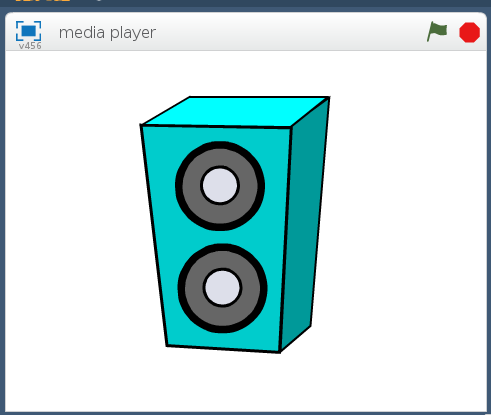

## Making it sparkle

Let's being by getting the Sense HAT to show a random sparkly display to accompany your favorite music.

--- task ---
Open Scratch 2 from the application menu.
[[[rpi-scratch-opening]]]
--- /task ---

--- task ---
Choose a sprite for your MP3 player — here we're going to use a speaker.

[[[generic-scratch-sprite-from-library]]]
--- /task ---

You can delete any scripts or sounds that are already on your sprite.

--- task ---
Add the **Pi SenseHAT** extension in Scratch.
[[[rpi-scratch-add-pi-sense-hat]]]
--- /task ---

Now you're all set up, you can begin to make your MP3 player by creating a disco effect on the display.

--- task ---
Begin by adding a `when flag clicked`{:class="blockevents"} block, and then add a `forever`{:class="blockcontrol"} block below it.
```blocks
when flag clicked
forever
```
--- /task ---

--- task ---
Within the **More Blocks** menu, find the `set pixel`{:class="blockmoreblocks"} block. By using the `pick random`{:class="blockoperators"} block, you can set random pixel positions and random colours within the loop to make your Sense HAT sparkle, by choosing LEDs on the SenseHAT to light up (numbers between 0 and 7 on the 8x8 grid), and the amount of red, green and blue to colour the pixels (numbers between 0 and 255).

```blocks
when flag clicked
forever
set pixel (pick random (0) to (7)),( pick random (0) to (7)) to R (pick random (0) to (255))G(pick random (0) to (255))B(pick random (0) to (255))::extension
```
--- /task ---

--- task ---
Have a go at running your program by clicking on the green flag. You should see the LEDs on the Sense HAT begin to randomly sparkle.
--- /task ---

