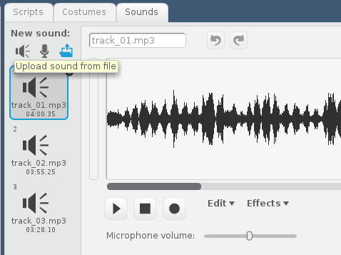
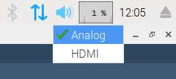

## Playing some tunes

Now you have a disco effect, it's time to make your MP3 player play some tunes!

--- task ---
Gather a few MP3 files together to begin with — you'll want a minimum of three. Save them in the same directory as your Scratch code.
--- /task ---

--- task ---
Click on the **Sounds** tab for your sprite, and use the **Upload sound from file** button to upload all your MP3 files.

--- /task ---

Now it's time to play your tracks.

--- task ---
Your code should currently look like this:
```blocks
when flag clicked
forever
set pixel (pick random (0) to (7)),( pick random (0) to (7)) to R (pick random (0) to (255))G(pick random (0) to (255))B(pick random (0) to (255))::extension
```
You can play a sound using the `play sound`{:class="blocksound"} block. Add this block above your `forever`{:class="blockcontrol"} loop.

```blocks
when flag clicked
play sound [track_01.mp3 v]
forever
set pixel (pick random (0) to (7)),( pick random (0) to (7)) to R (pick random (0) to (255))G(pick random (0) to (255))B(pick random (0) to (255))::extension
```
--- /task ---

--- task ---
Now click on the green flag to play your track as the disco lights start. Make sure you have speakers or headphones plugged into your Raspberry Pi. You might also need to change the sound output to **Analog** by right-clicking on the speaker icon in the header bar of the desktop and then clicking this option.

--- /task ---

